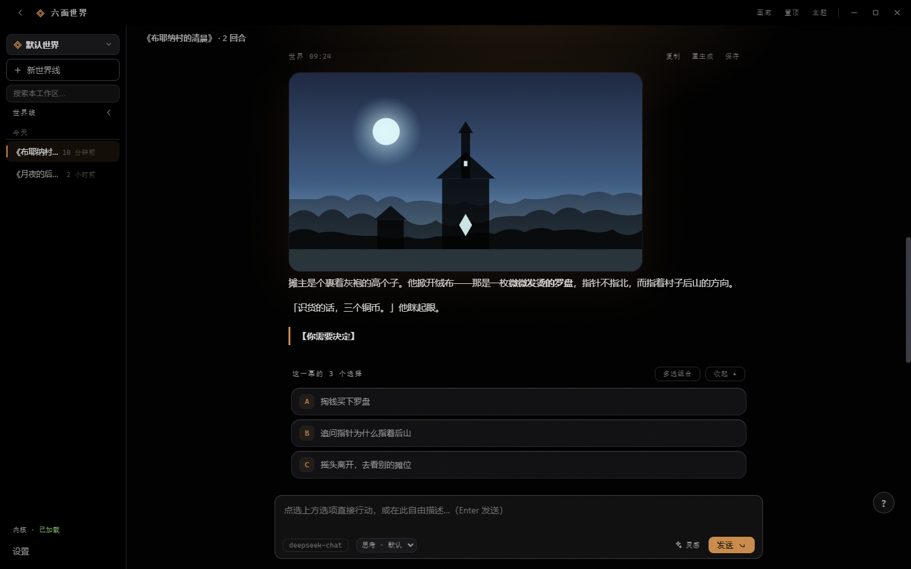
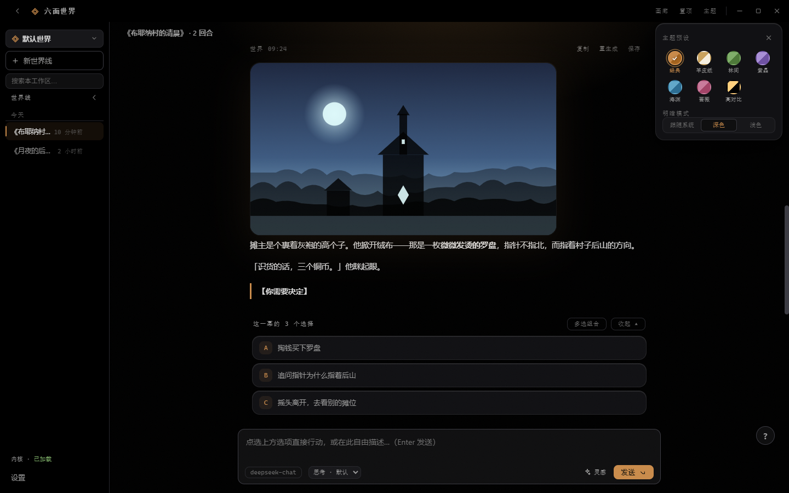
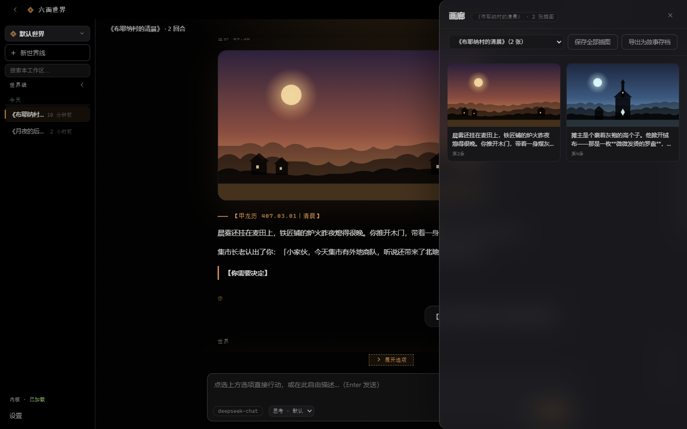
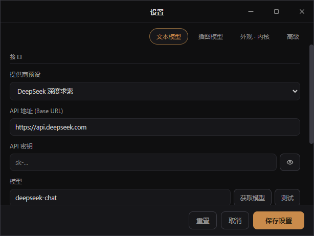

<div align="center">

# 六面世界 · Six Worlds

**一款 Windows 桌面端「AI 私人故事引擎」——内核即世界，导入即可玩，你的每个选择都算数。**

AI 逐幕推进叙事、每幕给出 A/B/C 选项按钮，也可自由行动；内置故事状态引擎（九大账本长期记忆 +
结构化落账），支持世界线分歧回溯（IF 线）、AI 插图生成、画廊集与故事存档导出。内核与玩法完全解耦：
换个内核文件，就是换一个世界。兼容任意 OpenAI 兼容大模型端点。

[功能总览](#功能总览) · [截图预览](#截图预览) · [快速开始](#快速开始) · [打包发布](#打包发布) · [开发与测试](#开发与测试) · [免责声明](#免责声明)

</div>

---

## 截图预览

| 入场动画 | 主界面 · 叙事与选项 |
| --- | --- |
|  |  |

| 主题弹层 · 7 调色板 × 明暗 | 羊皮纸浅色主题 |
| --- | --- |
|  |  |

| 画廊 · 插图集 | 设置 · 独立系统窗口 |
| --- | --- |
|  |  |

## 功能总览

### 故事引擎

- **回合制叙事**：AI 以【甲龙历 407.03.01｜清晨】式场景块逐幕推进，流式打字机输出、可随时「停止」（保留已生成半段）；
- **选项按钮**：每幕自动解析 A/B/C 选项渲染为可点击卡片（多格式兼容：【A】/ A. / 1. / ① / 加粗列表）；点击即行动；
- **多选组合**：Ctrl+点选多项 →「已选 N 项：A + B」→ 一键组合发送；选项区自动收起/展开（上滑翻历史不打扰）；
- **自由行动**：输入框自由描述（Enter 发送 · Shift+Enter 换行 · 空框按 ↑ 召回历史行动）；「灵感」一键填入行动提示；
- **IF 分歧回溯**：对结果不满意？悬停你发出的行动点「IF 分歧」——在新世界线复刻到该节点，换一个选择走向不同结局，母线完整保留；
- **消息工具条**：复制 · 重生成 · 生成插图 · IF 分歧 · 保存插图；
- **出身预设**：新世界线空态提供内核自定义的出身预设（来自内核 KERNEL_META，无则用通用模板），点击预填、可编辑再发送；
- **轻量 Markdown**：加粗 / 斜体 / 行内代码 / 分隔线，安全转义渲染。

### 故事状态引擎（长期记忆）

- **九大账本**：Decision / Commitment / Knowledge / Fact / Event / Causal / Relationship / Thread / Entity——
  玩家的每个重大选择、承诺、世界事实、人物关系与长期伏笔都结构化落账，永不静默覆盖（取代必留痕）；
- **结构化检索**：每回合由实体解析 + 关联扩展（实体共链 / 关系 / 因果）+ 多信号重排，自动把真正相关的历史
  送入模型上下文——百回合前的救命之恩、被拒绝的组织、丢掉的物品，换个说法仍然想得起来；
- **语义检索（sqlite-vec）**：事实 / 事件 / 决定随正本落盘同步写入本地向量索引（SQLite + sqlite-vec
  单文件库，按故事分区 KNN），向量 KNN + BM25 双通道与词面 / 实体信号融合召回；索引为可重建派生层——
  删除故事即清理、损坏自动重建、启动例行维护（VACUUM 压缩）；默认本地 hash 嵌入完全离线零外部服务，
  设置「高级 → 语义记忆」可切换真实模型嵌入（OpenAI 兼容 /v1/embeddings，如智谱 embedding-3）：
  同文本结果持久缓存、未热条目异步补嵌，检索路径零网络阻塞；
- **Context 硬预算**：发送给模型的上下文有硬上限与优先级（当前状态 > 场景 > 实体 > 决定 > 承诺 > 事实 > 事件），
  不随历史增长无限膨胀；
- **落账容错链**：模型没按协议输出状态块时，自动重试 → 引导修正 → 挂起待补录（Pending），重启不丢、
  一键补录；协议标记的常见变体（全角括号/少箭头/裸 JSON）均可自动识别；
- **快照 / 恢复**：手动快照一键回滚到任意节点；回合计数与全部账本精确还原；
- **经实测验证**：1001 回合连续长跑 3410 项断言全通过、真实 Electron 端到端 100 回合 + 重启恢复 +
  记忆挑战全部命中；5000 回合压力基准下每回合引擎耗时 ~30ms、上下文有界不膨胀。

### 世界与世界线

- **多工作区**：每个工作区独立的世界线集合 + 可绑定**专属世界内核**（不同世界并行、互不串线）；
- **多世界线**：持久化保存、双击重命名、拖拽排序、按 今天/昨天/7 天内/更早 自动分组、相对时间显示；
- **全局搜索**（侧栏，跨世界线标题+正文）+ **会话内搜索**（Ctrl+F，命中高亮 n/n 跳转，窗口外命中自动加载）；
- **大历史流畅**：聊天窗口化渲染（每次仅 60 条进 DOM，向上滚动按页加载），几千条消息切换世界线依然跟手；
- **故事进度条**：侧栏收起时左缘出现，节点=每次世界回应，悬停预览（含插图）、点击跳转那一幕。

### 内核设计工作台

- 顶部在**内容**与**内核设计**两个平级区域间切换（`Ctrl+K`），设计讨论不会进入故事对话；
- 内核库统一管理内置与用户内核，支持从通用模板新建、导入 Markdown、编辑、删除及应用到当前内容工作区；
- AI 协作按内核分别保存设计上下文，可从想法生成完整草稿，也可对大型内核执行精确局部修改；
- AI 修改只有在补丁唯一命中且 `KERNEL_META` 仍可解析时才会写入草稿，保存前始终显示未保存状态；
- 一个内容工作区绑定一个内核，不同工作区可以同时运行完全不同的世界规则与世界线集合。

### AI 插图

- OpenAI 兼容图像端点（OpenAI / 智谱 CogView / 硅基流动 Kolors / 通义万相 / 自定义）；
- 7 种画风（可自定义提示词）× 7 档尺寸 + 清晰度 / 负面词 / 种子锁定；
- 自动生成或悬停手动生成；失败自动重试 +「重试绘制」；
- **画廊**（Ctrl+G）：按世界线浏览全部插图、大图查看器（←→ 循环切换）、批量保存、**导出为自包含 HTML 故事存档**。

### 外观与主题

- **双界面方案**：主题抽屉顶部「界面方案」一键切换 **经典界面 / 原型工作台**（后者按高保真原型实现：
  内容画布 + 内核设计画布 + 画廊 + 世界菜单 + 设置面板）；切换即时生效，会话 / 世界线 / 设置 / 进度双方案
  完全共享，重启保持选择；
- **7 套调色板**（经典琥珀 / 羊皮纸 / 林间 / 紫晶 / 海渊 / 蔷薇 / 高对比）× **明暗三态**（跟随系统 / 深 / 浅）；
- 全部 14 组合关键对比度实测 WCAG AA；
- 字体（无衬线/衬线）、圆角、密度、阅读列宽、字号（Ctrl+=/-/0）全部可调、即时预览；
- 布局三模式（标准 / 专注 / 沉浸）+ 侧栏左右换向 + 灵动岛通知；
- **世界之灵桌宠**（经典 / 原型工作台双方案）：常驻内容画布两侧空白边距的活体小机器人——呼吸、眨眼、视线
  实时跟随鼠标（短半径归一，贴边也不钉死）；生成叙事时化作思考三点、完成亮通知徽标、报错变惊叹号；点击戳一戳
  并打开帮助气泡（使用指南小贴士 + 问答），右键弹快捷菜单（换边 / 归位 / 休息唤醒 / 接入模型），可拖拽搬家、
  位置记忆、窄窗自动隐藏。引擎为 bloub（[jeremy-prt/bloub](https://github.com/jeremy-prt/bloub)，MIT）的
  一次性内嵌转译，详见 `docs/bloub-vendor.md`。
- **桌宠双大脑对话**：应用类问题由内置规则库精准回答；其余问题优先走你在设置里配置的云端模型
  （更聪明、知识在线、知道当前时间），云端失败/未配置时自动回落本地小模型（约 400MB 一键接入，
  node-llama-cpp Vulkan/CPU 本地推理，断网可聊）。回复统一经清洗管线（剥幻觉 UI 指示/markdown 渣、
  重复标点收束、超长截句），流式打字机逐字上屏 + 表情联动。
- **桌宠智能体（替你操作应用）**：气泡快捷按钮或直接说人话——「这一幕选哪个」分析剧情推荐最佳
  选项（附「替我选」一键执行）；「托管 N 轮」逐轮代选推进剧情、每轮汇报理由，随时 Esc 停止；
  「哪幕值得配图」从最近剧情挑画面感最强的一幕并给出英文生图提示词，一键生成；「优化生图提示词」
  把当前幕浓缩成 40 词内英文提示词（可复制或直接生图）。判断走云端模型的结构化 JSON 决策
  （推荐键校验、围栏/杂文容错提取、越界拒绝），执行只经 app.js 注入的安全能力面（点选项/生图），
  碰不到密钥与其他数据。

### 模型与配置

- 预设 7 家 OpenAI 兼容端点（DeepSeek / OpenAI / Kimi / 智谱 / 通义 / 硅基流动 / 自定义），均可改地址/密钥/模型；
- 「获取模型」拉取 /models 下拉点选（带筛选）、「测试」连接验证（GET，不耗 token）；
- **思考程度**（默认/浅/中/深，映射 reasoning_effort）；对话栏直接切换模型；
- 模型用量芯片：本线 / 全部世界线 token 统计；配置导入/导出（JSON，脱敏不含密钥）。

### 移动端进度包

- 桌面端一键导出「进度包 JSON」（世界线 + 引擎结构化状态）；Android 配套 App（`mobile/`）导入即可接续进度，
  API 密钥在手机端走 Android Keystore 加密存储。

## 内核（Kernels）

内核 = 一个世界的完整规则书（纯 Markdown）。引擎与内核完全解耦：世界状态、长期记忆、选项契约、
补录协议全部由引擎承担，内核只负责世界观与玩法规则——**换内核即换世界，玩法能力一个不少**。

| 内核 | 说明 |
|---|---|
| `kernel.md` | 《六面世界：人生模拟器》——剑与魔法异世界转生 |
| `kernel-xianxia.md` | 《玄寰界：修真人生模拟器》——修真开放世界（175 条 / 10 卷，战力宪法 + 12 项逻辑闭环对冲） |

- 工作区级绑定：不同内容工作区可固定不同内核；换内核需显式应用（引擎按 sha1 校验内核版本，防串线）；
- 自定义内核：进入顶部「内核设计」即可新建、AI 协作设计或导入任意 Markdown；内核可按 `KERNEL_META`
  声明标题、开场白与出身预设，未声明则使用通用模板。

## 快速开始

### 方式一：下载打包版（推荐）

到 [Releases](https://github.com/tryanythingharder/Undecided-Sequel.Chapter/releases) 下载：

| 文件 | 说明 |
|---|---|
| `六面世界 Setup 1.4.0.exe` | 安装版：可选目录、创建快捷方式 |
| `六面世界-便携版-1.4.0.exe` | 免安装单文件，双击即用 |

### 方式二：源码运行

```powershell
git clone https://github.com/tryanythingharder/Undecided-Sequel.Chapter.git
cd Undecided-Sequel.Chapter
npm install        # 仅首次
npm start          # 或直接双击 启动游戏.cmd
```

### 首次配置

1. 启动后按向导选择外观（可跳过）；
2. 设置（Ctrl+,）→ 文本模型：选提供商、填 API Key（密钥经系统安全存储加密，请求由主进程发起，不写入 `localStorage`）；
3. 可选：插图模型同页配置；「测试」按钮验证连通性（不消耗 token）；
4. 工作区设置里选择世界内核（默认内置六面世界，可指向任意内核文件）。

### 常用快捷键

| 快捷键 | 功能 | 快捷键 | 功能 |
|---|---|---|---|
| `Enter` / `Shift+Enter` | 发送 / 换行 | `Ctrl+N` | 新世界线 |
| `↑`（空框） | 召回上一条行动 | `Ctrl+B` | 收起/展开侧栏 |
| `Ctrl+F` | 会话内搜索 | `Ctrl+G` | 画廊 |
| `Ctrl+,` | 设置 | `Ctrl+/` | 快捷键面板 |
| `Ctrl+=` / `Ctrl+-` / `Ctrl+0` | 字号 缩放/缩小/复位 | `Esc` | 关闭浮层 / 清空搜索 |

## 打包发布

```bash
npm run icon   # 可选：重新生成应用图标（build/icon.svg → .ico/.png）
npm run dist   # 打包 NSIS 安装版 + 便携版单文件（产物在 dist/）
```

- 国内网络慢可先设镜像：`$env:ELECTRON_MIRROR='https://npmmirror.com/mirrors/electron/'`
- 打包只含运行必需文件（main / preload / 双内核 / engine / renderer），不含 node_modules 与开发脚本。
- 本地无证书时会生成未签名产物，仅供测试；公开分发前须通过 electron-builder 支持的
  `CSC_LINK` / `CSC_KEY_PASSWORD` 注入 Authenticode 代码签名证书，并用
  `Get-AuthenticodeSignature` 确认状态为 `Valid`。

## 项目结构

```
├── main.cjs              # Electron 主进程：窗口/置顶/HTTP 桥(SSE 流式)/插图桥/状态引擎 IPC/单实例锁
├── preload.cjs           # contextBridge 安全桥，暴露极窄 IPC API
├── engine/               # 故事状态引擎（内核无关）：九大账本 / 检索(sqlite-vec 语义索引) / Context / 快照 / Pending
├── renderer/
│   ├── index.html        # 主界面 DOM
│   ├── settings.html     # 设置独立窗口
│   ├── app.js            # 界面逻辑（会话/选项解析/IF 线/画廊/主题/搜索/引擎桥…）
│   ├── settings.js       # 设置窗口逻辑（双窗口实时同步）
│   └── styles.css        # 全部样式（CSS 变量驱动 7 调色板 × 明暗）
├── renderer-proto/       # 原型工作台方案（与 renderer/ 共享数据与设置，主题抽屉可切换）
├── shared/               # 双方案共享层（会话持久化 / bloub 机器人引擎与挂载层）
├── sessions-db.cjs       # 会话 SQLite 主存（sessions.json 保留为兼容镜像）
├── kernel.md             # 内核《六面世界：人生模拟器》
├── kernel-xianxia.md     # 内核《玄寰界：修真人生模拟器》
├── mobile/               # Android 配套 App（导入桌面进度包接续游玩）
├── build/                # 应用图标（cat.png 黑猫源 → npm run icon 生成 .ico/.png）
├── docs/shots/           # README 截图
├── scripts-dev/          # 测试与基准脚本（见下）
└── 启动游戏.cmd           # 双击启动（首次自动 npm install）
```

## 开发与测试

- `npm start` — 开发运行；所有脚本以 `SIXWORLDS_TEST=1` 启动并重定向 userData 到 `test-profile/`，**永不触碰真实用户配置**；
- UI 回归：`verify.cjs`（34 项）、`e2e-mock.cjs`（mock 服务端全链路）、`test-choices.cjs`（选项解析）；
- 内核工作台：`test-kernel-hub.cjs`（内核库 / AI 设计 / 保存 / 绑定 / 重启恢复 / 导入 / 删除回落）；
- 世界之灵桌宠：`test-bloub.cjs`（91 项：15 状态 / 3000 帧确定性 / 规则问答契约 / 回复清洗管线 / 大脑路由 / 智能体意图路由 / 决策 JSON 容错提取）、`test-bloub-e2e.cjs`（真实渲染 53 项：边距常驻 / 视线真实位置差 / 右键快捷菜单 / 气泡问答 / 拖拽记忆 / 事件反应 / 窄窗适配 / 本地小模型一键接入全流程 / 云端→本地大脑路由 / 智能体推荐→代选→托管→配图→提示词——假下载源接缝，不在 CI 下 400MB）；
- 引擎测试：`test-story-engine.cjs`（42 项）、`test-access.cjs`（24 项权限）、`test-patch-reliability.cjs`（46 项协议容错）、`test-engine-e2e.cjs`；
- 长篇压测：`stress-run.cjs`（1001 回合真实演进 / 3410 断言）、`stress-e2e.cjs`（真实 Electron 100 回合 + 重启 + 记忆挑战）；
- 性能与记忆基准：`bench.cjs`（100~5000 回合）、`bench-fe.cjs`（前端大历史）、`bench-recall.cjs`（七类查询 × 距离分层 Recall）；
- 内核校验：`validate-kernel-xianxia.cjs`（175 规则）；
- 测试脚本基于 Playwright（驱动本地 Electron，无需下载浏览器）：`npm i -D playwright` 后即可运行。

## 常见问题

<details>
<summary><b>请求报 401 / 429 / 超时？</b></summary>
错误已本地化为中文提示：401 检查密钥、429 为限流稍后再试、超时可重发（错误消息带「重试这一回合」）。流式中断会保留已生成的半段文本。
</details>

<details>
<summary><b>消息上出现「状态未落账」怎么办？</b></summary>
说明该回合模型没有按协议输出状态块（剧情已展示，但结构化状态未提交）。系统已自动重试并挂起待补录：点击消息上的徽标或顶部横幅可一键补录；若某个模型频繁出现，建议换推理能力更强的模型。完整原因可在检查器的回合日志中查看。
</details>

<details>
<summary><b>换电脑如何迁移配置？</b></summary>
设置 → 高级 → 导出配置（JSON，<b>不含密钥</b>）；新机器导入后重填密钥即可。世界线数据保存在本机 <code>%APPDATA%/六面世界</code>。
</details>

<details>
<summary><b>支持非 DeepSeek 的模型吗？</b></summary>
支持任意 OpenAI 兼容端点（含本地 Ollama / LM Studio），改 Base URL 即可；不支持流式的端点自动回退非流式。
</details>

## 免责声明

- 本项目为**本地个人工具**，代码采用 MIT 许可证；
- `kernel.md` 世界内核为基于《无职转生》的同人创作，版权归原作（理不尽な孫の手）所有，仅作学习交流，不得用于商业用途；
- `kernel-xianxia.md` 为原创修真世界观内核：远景人名与关系骨架仅参考公开出版物信息并逐项标注精度，细节均为原创补全，不引用、不复述任何原著文本；
- 使用本工具产生的 AI 生成内容由使用者自行负责；调用模型/插图 API 产生的费用由使用者自行承担；
- 请遵守所接模型服务商的服务条款。

## License

[MIT](LICENSE) © 2026
