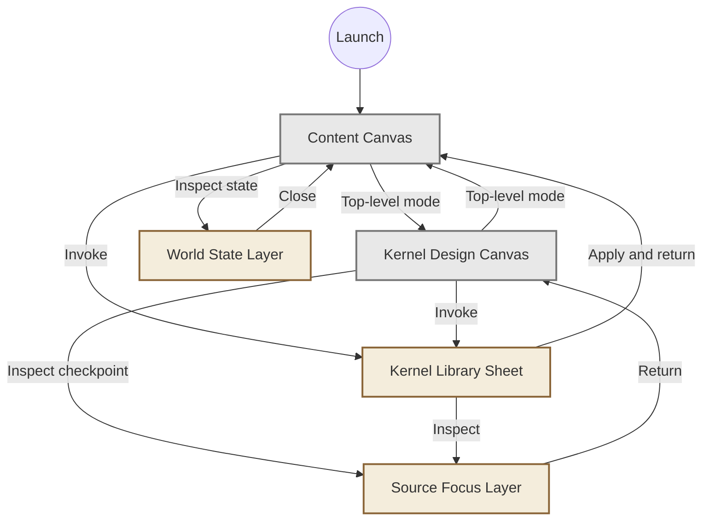

# Master Screen Map

```mermaid
graph TD
    Entry((Launch)) --> Content[Content Canvas]
    Content -->|Top-level mode| Design[Kernel Design Canvas]
    Design -->|Top-level mode| Content
    Content -->|Invoke| Library[Kernel Library Sheet]
    Design -->|Invoke| Library
    Design -->|Inspect checkpoint| Source[Source Focus Layer]
    Library -->|Inspect| Source
    Source -->|Return| Design
    Library -->|Apply and return| Content
    Content -->|Inspect state| State[World State Layer]
    State -->|Close| Content

    classDef screen fill:#e8e8e8,stroke:#777,stroke-width:2px
    classDef layer fill:#f4eddc,stroke:#8a6538,stroke-width:2px
    class Content,Design screen
    class Library,Source,State layer
```

