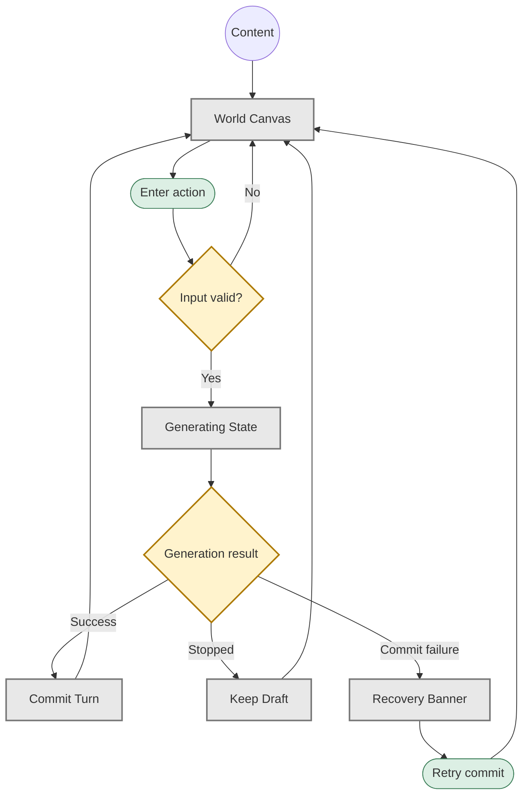

# UC-001 Flow

```mermaid
graph TD
    Start((Content)) --> Canvas[World Canvas]
    Canvas --> Act([Enter action])
    Act --> Valid{Input valid?}
    Valid -->|No| Canvas
    Valid -->|Yes| Generate[Generating State]
    Generate --> Result{Generation result}
    Result -->|Success| Commit[Commit Turn]
    Result -->|Stopped| Draft[Keep Draft]
    Result -->|Commit failure| Recovery[Recovery Banner]
    Commit --> Canvas
    Draft --> Canvas
    Recovery --> Resolve([Retry commit])
    Resolve --> Canvas

    classDef screen fill:#e8e8e8,stroke:#777,stroke-width:2px
    classDef decision fill:#fff3cd,stroke:#ad7900,stroke-width:2px
    classDef action fill:#dcefe4,stroke:#3f805b,stroke-width:1px
    class Canvas,Generate,Commit,Draft,Recovery screen
    class Valid,Result decision
    class Act,Resolve action
```

