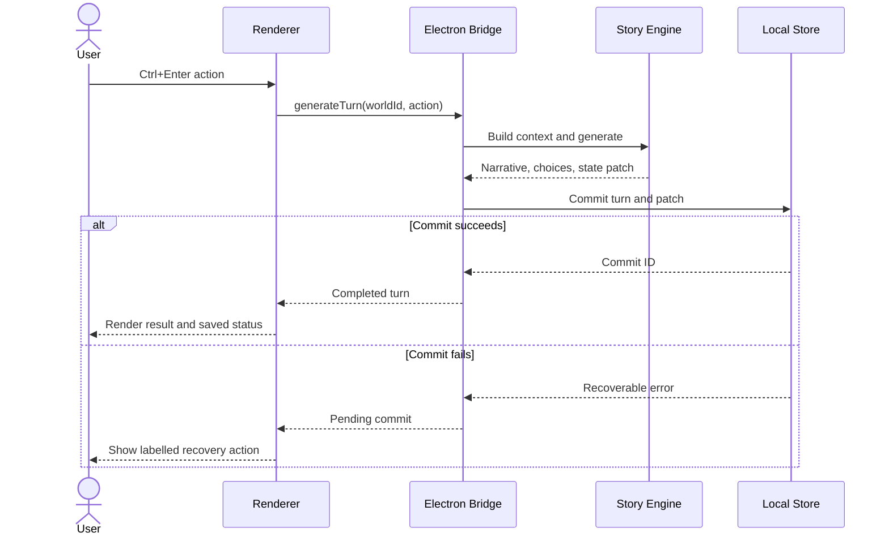

# UC-001 Sequence

```mermaid
sequenceDiagram
    actor User
    participant App as Renderer
    participant Bridge as Electron Bridge
    participant Engine as Story Engine
    participant Store as Local Store

    User->>App: Ctrl+Enter action
    App->>Bridge: generateTurn(worldId, action)
    Bridge->>Engine: Build context and generate
    Engine-->>Bridge: Narrative, choices, state patch
    Bridge->>Store: Commit turn and patch
    alt Commit succeeds
        Store-->>Bridge: Commit ID
        Bridge-->>App: Completed turn
        App-->>User: Render result and saved status
    else Commit fails
        Store-->>Bridge: Recoverable error
        Bridge-->>App: Pending commit
        App-->>User: Show labelled recovery action
    end
```

