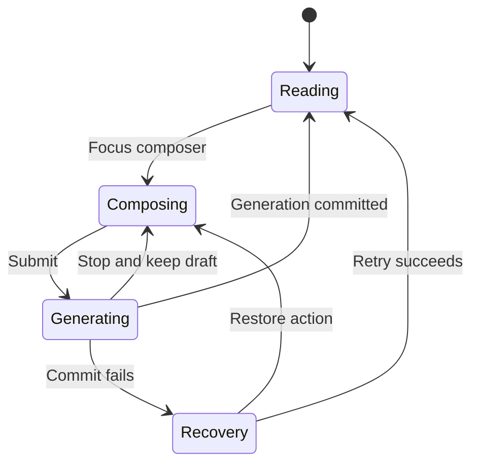

# UC-001 States

```mermaid
stateDiagram-v2
    [*] --> Reading
    Reading --> Composing: Focus composer
    Composing --> Generating: Submit
    Generating --> Reading: Generation committed
    Generating --> Composing: Stop and keep draft
    Generating --> Recovery: Commit fails
    Recovery --> Reading: Retry succeeds
    Recovery --> Composing: Restore action
```

