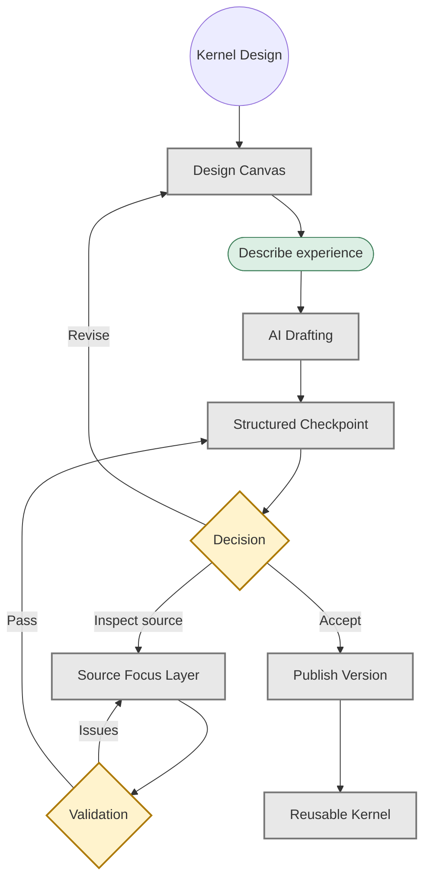

# UC-002 Flow

```mermaid
graph TD
    Start((Kernel Design)) --> Brief[Design Canvas]
    Brief --> Describe([Describe experience])
    Describe --> Drafting[AI Drafting]
    Drafting --> Checkpoint[Structured Checkpoint]
    Checkpoint --> Review{Decision}
    Review -->|Revise| Brief
    Review -->|Inspect source| Source[Source Focus Layer]
    Source --> Validate{Validation}
    Validate -->|Issues| Source
    Validate -->|Pass| Checkpoint
    Review -->|Accept| Publish[Publish Version]
    Publish --> Done[Reusable Kernel]

    classDef screen fill:#e8e8e8,stroke:#777,stroke-width:2px
    classDef decision fill:#fff3cd,stroke:#ad7900,stroke-width:2px
    classDef action fill:#dcefe4,stroke:#3f805b,stroke-width:1px
    class Brief,Drafting,Checkpoint,Source,Publish,Done screen
    class Review,Validate decision
    class Describe action
```

