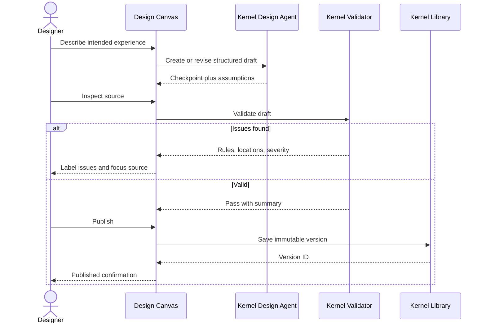

# UC-002 Sequence

```mermaid
sequenceDiagram
    actor Designer
    participant App as Design Canvas
    participant Agent as Kernel Design Agent
    participant Validator as Kernel Validator
    participant Library as Kernel Library

    Designer->>App: Describe intended experience
    App->>Agent: Create or revise structured draft
    Agent-->>App: Checkpoint plus assumptions
    Designer->>App: Inspect source
    App->>Validator: Validate draft
    alt Issues found
        Validator-->>App: Rules, locations, severity
        App-->>Designer: Label issues and focus source
    else Valid
        Validator-->>App: Pass with summary
        Designer->>App: Publish
        App->>Library: Save immutable version
        Library-->>App: Version ID
        App-->>Designer: Published confirmation
    end
```

