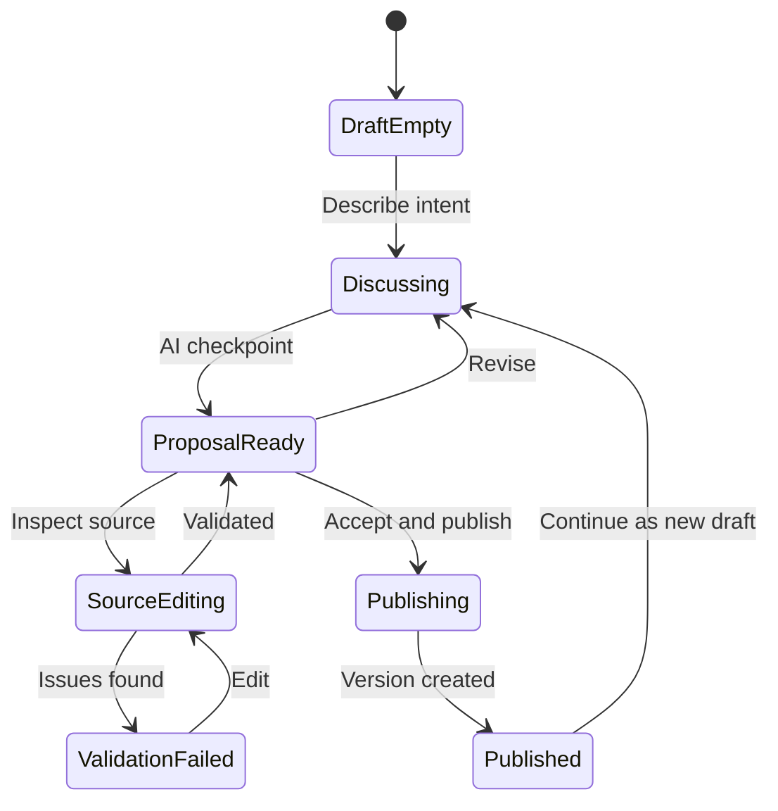

# UC-002 States

```mermaid
stateDiagram-v2
    [*] --> DraftEmpty
    DraftEmpty --> Discussing: Describe intent
    Discussing --> ProposalReady: AI checkpoint
    ProposalReady --> Discussing: Revise
    ProposalReady --> SourceEditing: Inspect source
    SourceEditing --> ValidationFailed: Issues found
    ValidationFailed --> SourceEditing: Edit
    SourceEditing --> ProposalReady: Validated
    ProposalReady --> Publishing: Accept and publish
    Publishing --> Published: Version created
    Published --> Discussing: Continue as new draft
```

