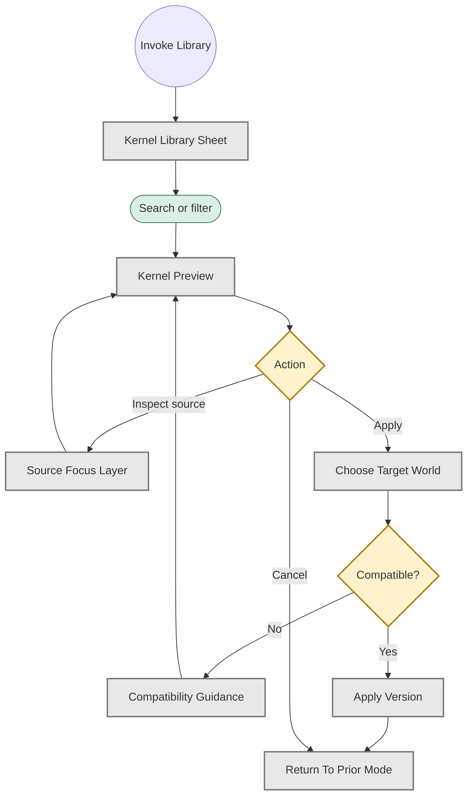

# UC-003 Flow

```mermaid
graph TD
    Start((Invoke Library)) --> Library[Kernel Library Sheet]
    Library --> Search([Search or filter])
    Search --> Select[Kernel Preview]
    Select --> Action{Action}
    Action -->|Inspect source| Source[Source Focus Layer]
    Source --> Select
    Action -->|Apply| Destination[Choose Target World]
    Destination --> Compatible{Compatible?}
    Compatible -->|No| Explain[Compatibility Guidance]
    Explain --> Select
    Compatible -->|Yes| Apply[Apply Version]
    Apply --> Return[Return To Prior Mode]
    Action -->|Cancel| Return

    classDef screen fill:#e8e8e8,stroke:#777,stroke-width:2px
    classDef decision fill:#fff3cd,stroke:#ad7900,stroke-width:2px
    classDef action fill:#dcefe4,stroke:#3f805b,stroke-width:1px
    class Library,Select,Source,Destination,Explain,Apply,Return screen
    class Action,Compatible decision
    class Search action
```

