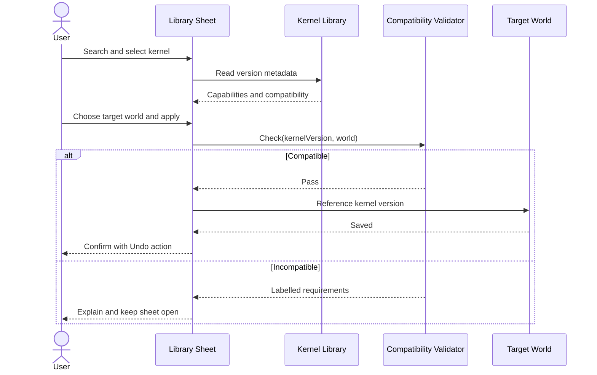

# UC-003 Sequence

```mermaid
sequenceDiagram
    actor User
    participant App as Library Sheet
    participant Library as Kernel Library
    participant Validator as Compatibility Validator
    participant World as Target World

    User->>App: Search and select kernel
    App->>Library: Read version metadata
    Library-->>App: Capabilities and compatibility
    User->>App: Choose target world and apply
    App->>Validator: Check(kernelVersion, world)
    alt Compatible
        Validator-->>App: Pass
        App->>World: Reference kernel version
        World-->>App: Saved
        App-->>User: Confirm with Undo action
    else Incompatible
        Validator-->>App: Labelled requirements
        App-->>User: Explain and keep sheet open
    end
```

